# [PHP] NEWS WEBSITE

## Introduction

Here is my php source code for NEWS BLOG. With my code: 
* **Create news articles on a variety of topics: science, technology, automotive, education, sports, economy,...**
* **Get news articles by RSS and XML through 3rd source**
* **User permissions flexible**

## Detail
* **Admin dashboard**
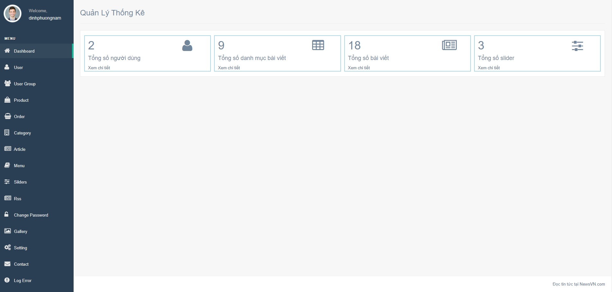

* **Manage articles**
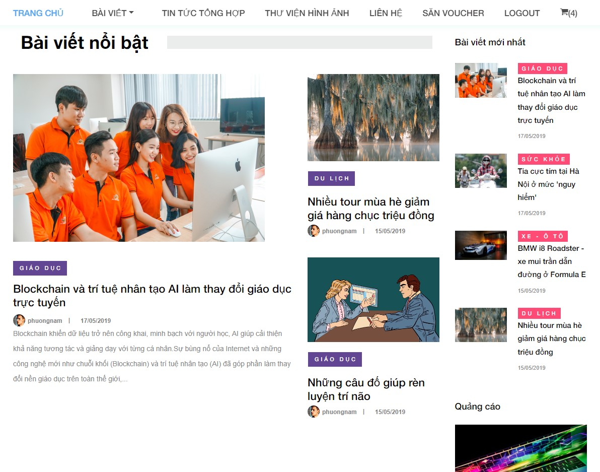
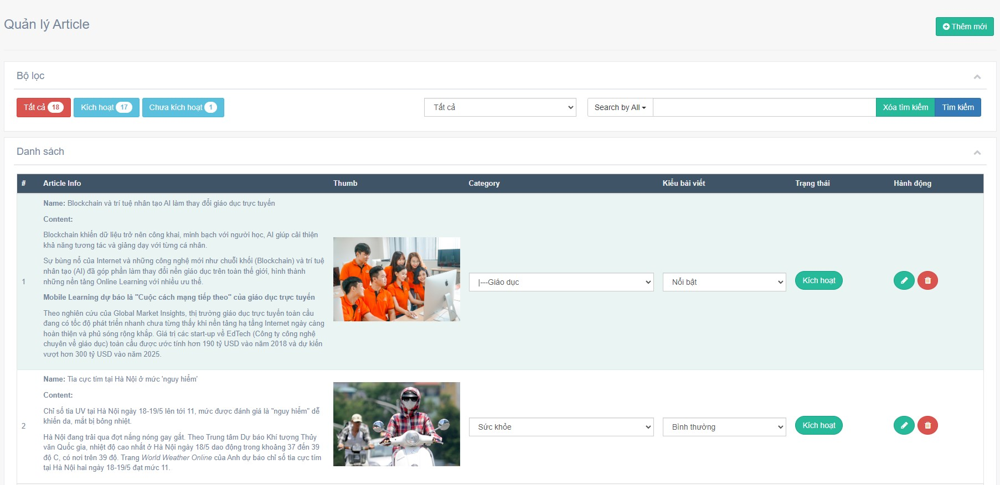

* **User permissions flexible**
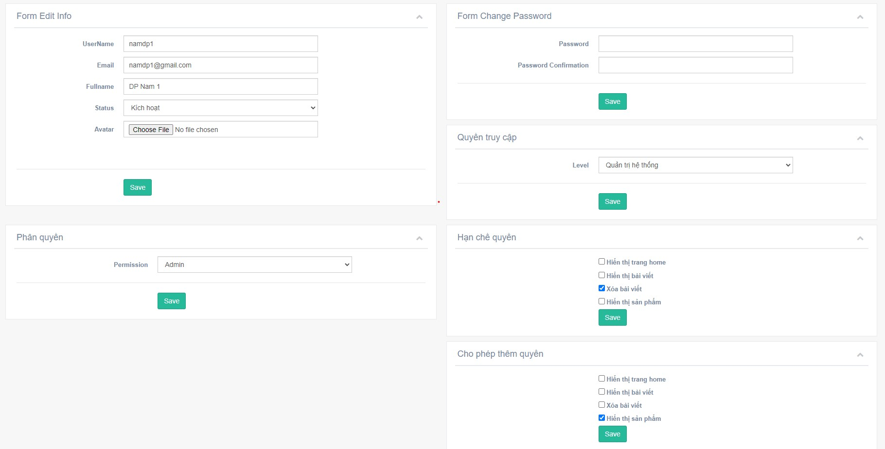

* **Multi-level category**
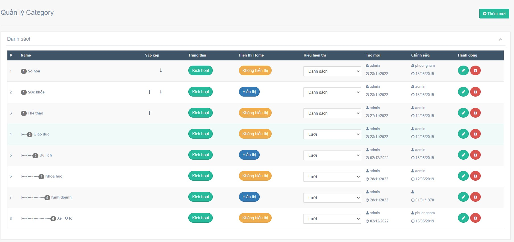

* **Import and export products using Excel**
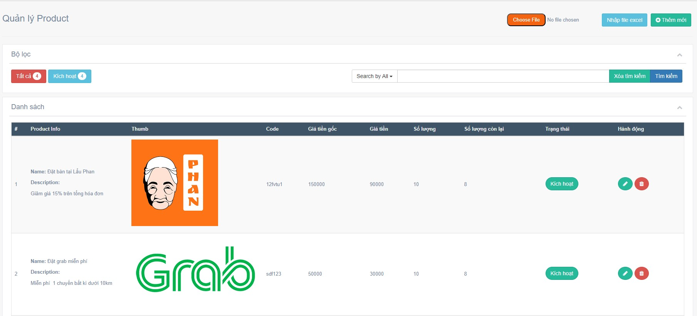

* **Manage the shopping cart. Use the queue to send an email to customers with their order status and an attached PDF invoice**
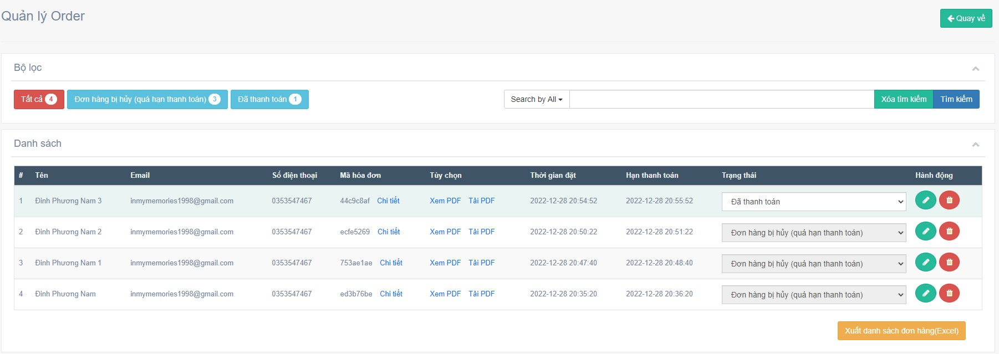

* **Shopping cart**
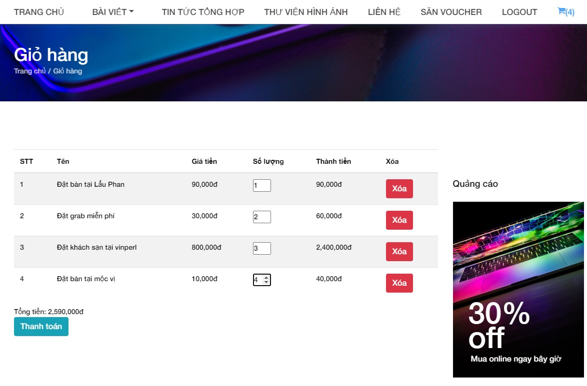

* **Payment info and bill**
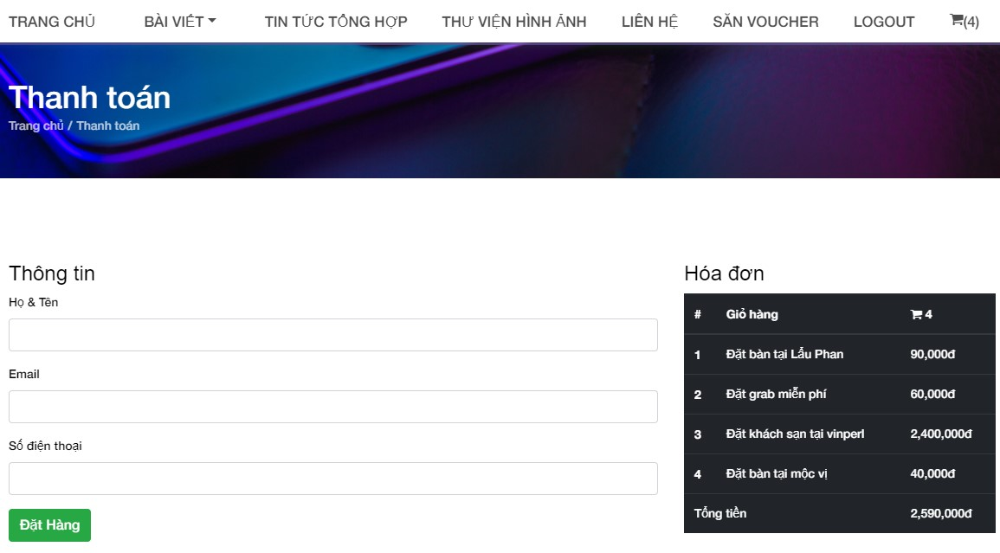

* **Use RSS to show general news and XML to show gold price**

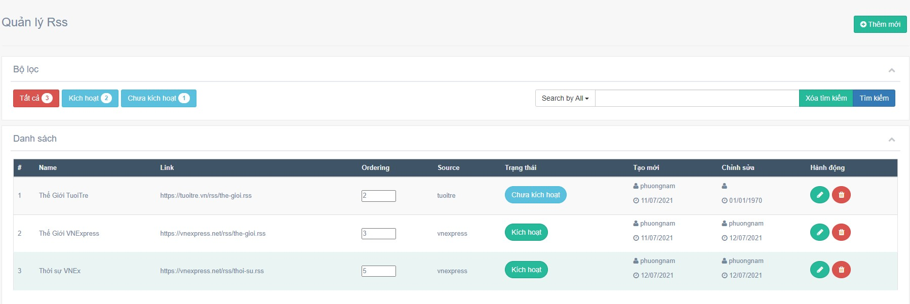

* **Setting email flexible by typing in the form but not using through .env**
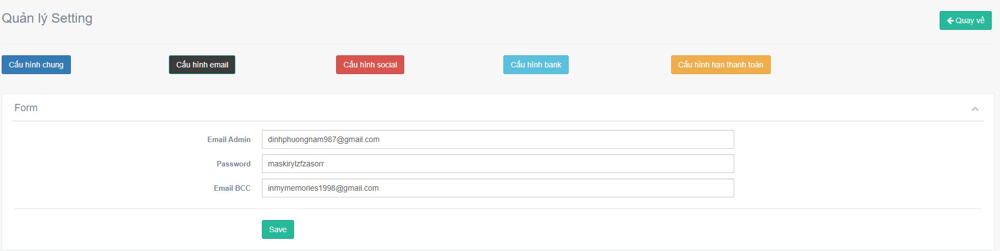

* **Manage customer contact information and notify the administrator via email**
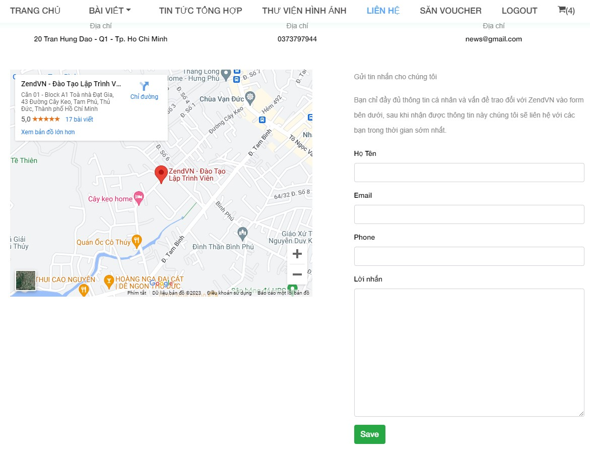
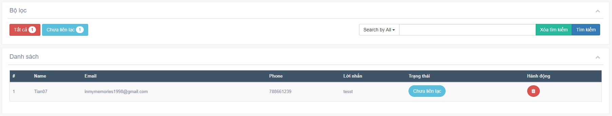

* **Use the Laravel mix to compress the file and speedup**

## Technologies:
* **PHP, Laravel, Javascript, Jquery, Ajax, HTML, CSS**

## How to run my code:
* **Step 1: Clone project**
* **Step 2: Go to the project folder**
* **Step 3: Import database news_project.sql in database folder**
* **Step 4: Copy .env.example file to .env on the root folder**
* **Step 5: Run "composer install" on your cmd or terminal**
* **Step 6: Run "php artisan key:generate"**
* **Step 7: Run "php artisan serve"**
* **Step 8: Go to the  admin page by login with username: admin@gmail.com and password: 123456**
* **Step 9: If you want to run the Laravel mix, let's run: "npm install" then "npm run watch"**

## Requirements
* **PHP version >= 7.3**
* **Node version > 14**
* **Composer**
* **Npm**